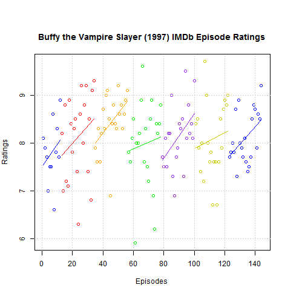

## Do I really want to continue watching this TV series?

* We've all asked ourselves this question after watching one or two episodes of a series.

* Some shows grab you right away and you're hooked.

* Others can take a while to build up to a compelling story.

--- .class #id 

## Find out instantly if a TV series gets better or worse over time

* Don't waste money on expensive DVD box sets that you won't watch.

* Don't waste time binge watching Netflix series that you'll stop halfway through.

* Find out which seasons are the best and worst without reading reviews.

---

## How does it work?

* Choose from over 9,000 TV series rated on IMDb.
* All episode ratings on IMDb for that series will be plotted.

 

---

## What other information is available?

* Best Season

* Worst Season

* Number of Episodes

* Total number of IMDb user ratings

* Series trend line (optional)

* Whether the series gets better or worse over time

Try it out now at [TV Series IMDb Ratings]("https://billcruise.shinyapps.io/tv-ratings/")

